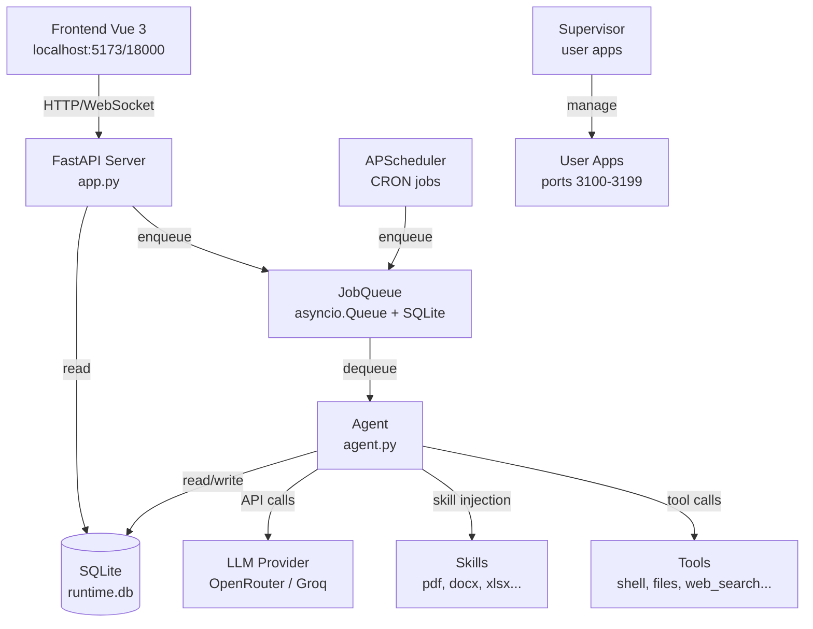
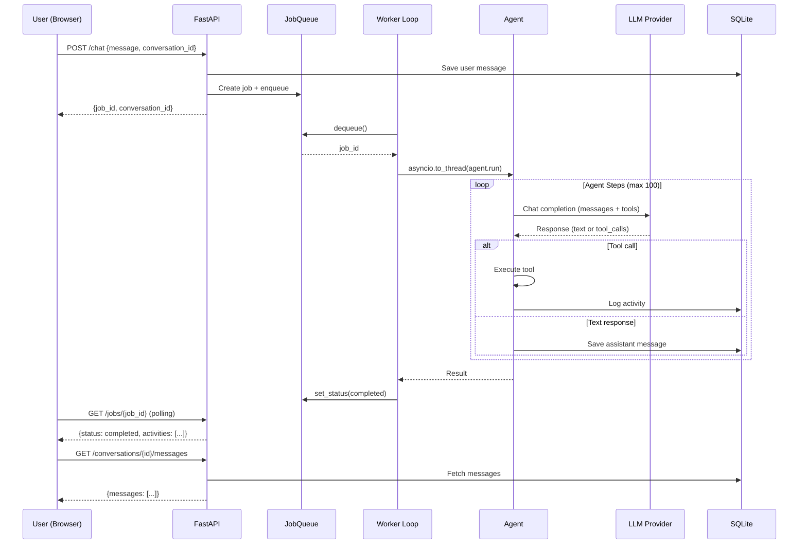
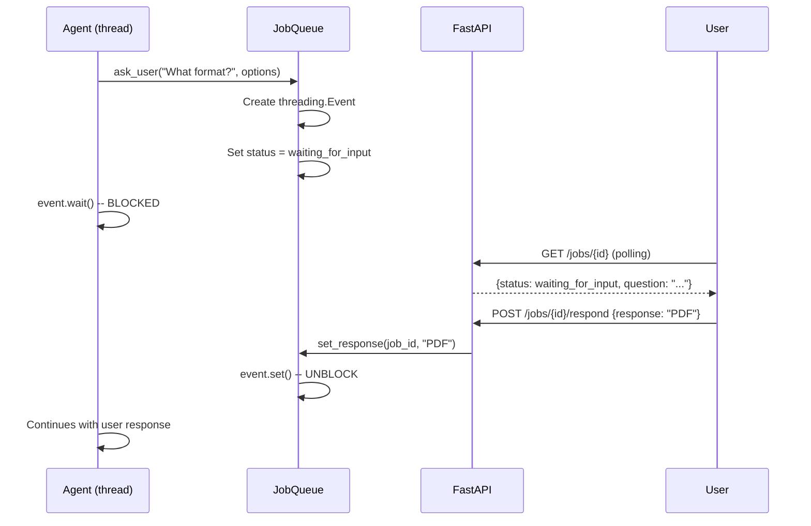
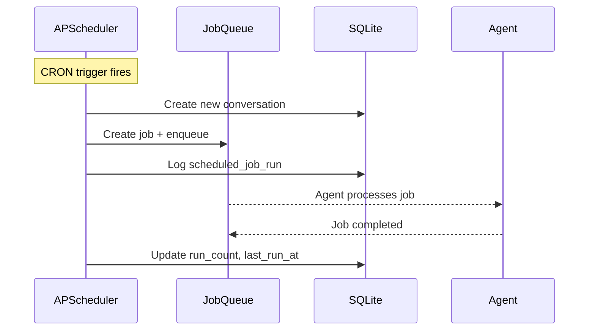
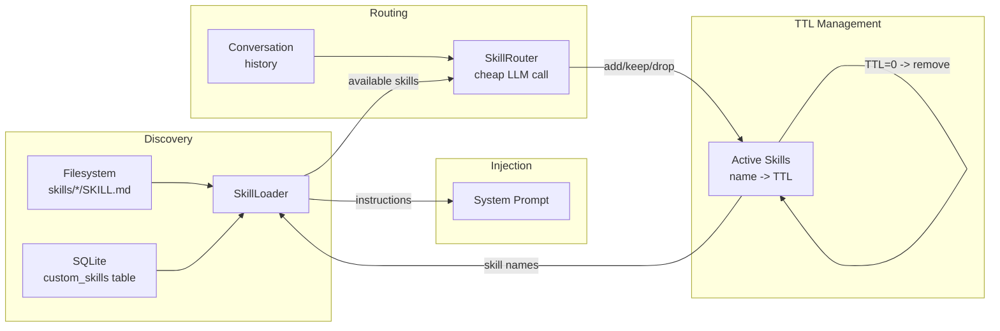

# ZENO - Mapa Projektu

Autonomiczny agent AI, natywna aplikacja desktopowa.
Architektura single-process: FastAPI + asyncio, SQLite, bez Redis/Docker.

---

## Spis treści

**Struktura projektu:**
- [Pliki w katalogu glownym](#pliki-w-katalogu-głównym)
- [user_container/ - Backend Python](#user_container---backend-python-serce-aplikacji)
- [frontend/ - Frontend Vue 3](#frontend---frontend-vue-3-chat-ui)
- [workspace/ - Przestrzen robocza](#workspace---przestrzeń-robocza-użytkownika)
- [data/ - Dane aplikacji](#data---dane-aplikacji)
- [build/ i dist/](#build-i-dist---artefakty-builda)

**Architektura i mechanizmy:**
- [Kluczowe mechanizmy architektury](#kluczowe-mechanizmy-architektury)
- [Architektura - diagramy](#architektura---diagramy)
- [Schemat bazy danych](#schemat-bazy-danych)

**Dla developera:**
- [Szybki start](#szybki-start-dla-developera)
- [API - lista endpointow](#api---lista-endpointów)
- [Zmienne srodowiskowe](#zmienne-środowiskowe)
- [Frontend - architektura](#frontend---architektura)
- [Jak dodac nowy tool](#jak-dodać-nowy-tool)
- [Jak stworzyc custom skill](#jak-stworzyć-custom-skill)
- [Troubleshooting](#troubleshooting)
- [Konwencje i code style](#konwencje-i-code-style)

**Legenda:**
- `>` sciezka pliku/katalogu
- `$` komenda do uruchomienia
- **wymagane** - konieczne do dzialania
- *(opcjonalne)* - mozna pominac

---

## Pliki w katalogu głównym

### Punkt wejścia i uruchomienie

| Plik | Opis |
|------|------|
| `zeno.py` | Główny punkt wejścia aplikacji. Zarządza venv, instalacją zależności, budowaniem frontendu i uruchamia serwer uvicorn. Obsługuje tryb bundled (PyInstaller) i source. |
| `start.sh` | Skrypt startowy deweloperski. Tworzy `~/.zeno/venv`, instaluje zależności, buduje frontend i uruchamia `zeno.py`. |
| `install.sh` | Oficjalny instalator. Pobiera ZENO z GitHub, instaluje uv (menedżer Pythona), konfiguruje `~/.zeno`, tworzy skrypt launchera. |
| `entrypoint.sh` | Entrypoint kontenera Docker. |

### Build i pakowanie

| Plik | Opis |
|------|------|
| `build.sh` | Buduje samodzielną aplikację `ZENO.app` na macOS przez PyInstaller. |
| `zeno.spec` | Specyfikacja PyInstaller - hidden imports, pliki danych, metadane aplikacji macOS. |
| `Makefile` | Komendy deweloperskie: `make up/down` (Docker), `make local` (natywnie), `make frontend-dev/build`, `make test`. |

### Docker

| Plik | Opis |
|------|------|
| `Dockerfile` | Multi-stage build. Instaluje system deps (pandoc, LibreOffice, poppler, Node.js), Python deps przez uv, Playwright z Chromium. |
| `docker-compose.yml` | Konfiguracja Docker Compose. Port 18000:8000, volumy (workspace, data), limity zasobów (2 CPU, 4GB RAM). |
| `.dockerignore` | Pliki wykluczone z kontekstu Docker build. |

### Konfiguracja

| Plik | Opis |
|------|------|
| `requirements.txt` | Zależności Pythona (22 pakiety): anthropic, openai, fastapi, uvicorn, beautifulsoup4, pdfplumber, APScheduler, litellm, sentry-sdk itd. |
| `.env` | Konfiguracja użytkownika (gitignored). |
| `.env.example` | Szablon zmiennych środowiskowych z opisami. |
| `env.example` | Uproszczony szablon env. |
| `.gitignore` | Reguły ignorowania plików przez Git. |

### Dokumentacja

| Plik | Opis |
|------|------|
| `README.md` | Quick start, instalacja, architektura, użycie Docker. |
| `CLAUDE.md` | Instrukcje dla Claude Code - konwencje, komendy, struktura projektu. |
| `VISION.md` | Wizja produktu - misja ZENO, zasady (privacy-first, autonomia, prostota), architektura. |
| `LICENSE` | Licencja MIT. |

---

## `user_container/` - Backend Python (serce aplikacji)

### Pliki główne

| Plik | Opis |
|------|------|
| `app.py` | Główna aplikacja FastAPI. Endpointy: chat, health check, upload/download plików, zarządzanie konwersacjami, serwowanie statycznych plików frontendu, CORS, auth middleware, Sentry. |
| `config.py` | Klasa Settings (Pydantic). Ścieżki, konfiguracja LLM (OpenRouter, Groq), ustawienia agenta (max_tool_calls, max_steps, limity kontekstu), klucze API. |
| `auth.py` | Middleware autentykacji hasłowej. Sesje z tokenami JWT. |
| `security.py` | Narzędzia bezpieczeństwa (inicjalizacja pliku secrets). |
| `admin.py` | Panel administracyjny (HTTP Basic Auth). |
| `api_v1.py` | Router API v1 (dodatkowe endpointy). |
| `logger.py` | Strukturalne logowanie (agent, tools, LLM requests). |
| `pricing.py` | Kalkulacja kosztów użycia LLM. |
| `costs.json` | Dane cenowe różnych modeli. |

### `agent/` - Rdzeń agenta AI

| Plik | Opis |
|------|------|
| `agent.py` | Główna klasa Agent. Autonomiczne wykonywanie z dynamicznym ładowaniem skilli, wykonywaniem narzędzi, tagami `<thinking>`, zarządzaniem kontekstem, detekcją pętli, planowaniem i refleksją. |
| `llm_client.py` | Abstrakcja klienta LLM. Obsługuje Anthropic, OpenAI, OpenRouter, Groq. Streaming, liczenie tokenów, śledzenie kosztów. |
| `routing.py` | Agent routingowy - klasyfikuje złożoność zadań (depth 0/1/2) używając szybkich modeli (Groq). |
| `prompts.py` | Prompty systemowe, opisy narzędzi, szablony iniekcji skilli. |
| `skill_loader.py` | Dynamiczne odkrywanie skilli z katalogu `/skills/`. Parsuje pliki SKILL.md. |
| `skill_router.py` | Selekcja skilli oparta na TTL. Skille wygasają po N krokach bez użycia. |
| `delegate_executor.py` | Równoległe wykonywanie sub-agentów (model Haiku). |
| `explore_executor.py` | Dedykowany executor do eksploracji i badania kodu. |
| `planned_executor.py` | Logika planowania i refleksji (kiedy injektować, jak formatować). |
| `context_manager.py` | Kompresja kontekstu przy progu 70%. Zachowuje ostatnie wiadomości i podsumowania. |
| `conversation_summarizer.py` | Hierarchiczna pamięć z semantycznymi podsumowaniami. Aktualizacja co N wiadomości. |
| `context.py` | Thread-local storage kontekstu (job_id, conversation_id). |
| `loop_detector.py` | Wykrywanie powtarzających się wzorców, wymuszanie postępu. |
| `progress_estimator.py` | Estymacja postępu zadania na podstawie wywołań narzędzi. |
| `suggestion_generator.py` | Generowanie sugestii follow-up po odpowiedzi agenta. |

### `tools/` - Wbudowane narzędzia

| Plik | Opis |
|------|------|
| `shell.py` | Wykonywanie komend shell w katalogu workspace. |
| `files.py` | Operacje na plikach: read_file, write_file, edit_file, list_dir. |
| `search_tools.py` | search_in_files (grep), recall_from_chat (wyszukiwanie RAG). |
| `web_fetch.py` | Pobieranie i parsowanie stron WWW (beautifulsoup4). |
| `web_search.py` | Wyszukiwanie w internecie przez Serper API. |
| `ask_user.py` | Pytanie użytkownika o input/wyjaśnienie (blokuje job do odpowiedzi). |
| `delegate.py` | Delegowanie podzadania do równoległego sub-agenta. |
| `explore.py` | Eksploracja kodu (wyspecjalizowane do analizy plików). |
| `schedule.py` | Tworzenie/listowanie/aktualizacja zaplanowanych jobów (składnia CRON). |
| `registry.py` | Rejestr narzędzi (zarządza dostępnymi narzędziami). |

### `skills/` - Dynamiczne skille (11 katalogów)

Każdy skill to katalog z `SKILL.md` (opis + instrukcje) i `scripts/` (skrypty Python). Auto-ładowane przez SkillRouter.

| Skill | Opis |
|-------|------|
| `pdf/` | Operacje PDF: ekstrakcja, tworzenie, łączenie, dzielenie, wypełnianie formularzy. 8 skryptów. |
| `docx/` | Operacje DOCX: odczyt, zapis, edycja, manipulacja OOXML. 3 skrypty + moduł ooxml. |
| `xlsx/` | Operacje Excel: analiza, porównywanie, konwersja, przeliczanie. 4 skrypty. |
| `image/` | Analiza obrazów (Claude/GPT-4V vision), preprocessing. 3 skrypty. |
| `transcription/` | Transkrypcja audio/wideo (Whisper API). 1 skrypt. |
| `website_screenshot/` | Screenshoty stron WWW (Playwright). 1 skrypt. |
| `web-app-builder/` | Budowanie web appów (FastAPI + Alpine.js + Tailwind). 1 skrypt + docs. |
| `app-deploy/` | Deploy i zarządzanie web appami (start, stop, restart, logi, usuwanie). 8 skryptów. |
| `frontend-design/` | Asystent projektowania frontend. |
| `n8n/` | Generowanie workflow n8n. |
| `video/` | Przetwarzanie wideo (eksperymentalne). |

### `jobs/` - System kolejki zadań

In-process (zastępuje Redis):

| Plik | Opis |
|------|------|
| `queue.py` | Klasa JobQueue. In-memory `asyncio.Queue` + persystencja SQLite. Obsługa stanów jobów, enqueue/dequeue, eventy ask_user (`threading.Event` jako most sync/async). |
| `job.py` | Model Job (id, conversation_id, message, status, timestamps). |

### `db/` - Warstwa bazodanowa

| Plik | Opis |
|------|------|
| `db.py` | Wrapper SQLite z trybem WAL. Tabele: conversations, messages, jobs, job_activity, scheduled_jobs, apps, sessions. |

### `scheduler/` - Harmonogram zadań

APScheduler-based CRON scheduling:

| Plik | Opis |
|------|------|
| `scheduler.py` | Inicjalizacja schedulera, zarządzanie jobami (add, update, delete, trigger). |
| `models.py` | Modele Pydantic dla scheduled jobs. |
| `cron_utils.py` | Narzędzia CRON (parsowanie, walidacja, następne uruchomienie). |

### `runner/` - Wykonywanie skryptów

| Plik | Opis |
|------|------|
| `runner.py` | Wykonuje skrypty Python w sandboxie. Przechwytuje stdout/stderr, obsługuje timeouty. |

### `supervisor/` - Nadzorca aplikacji

Zarządza web appami deployowanymi przez użytkownika:

| Plik | Opis |
|------|------|
| `supervisor.py` | Cykl życia aplikacji (start, stop, restart, health checks, streaming logów). |
| `ports.py` | Alokacja portów (pula 3100-3199). |

### `observability/` - Monitoring

Opcjonalna obserwowalność przez Langfuse:

| Plik | Opis |
|------|------|
| `langfuse_client.py` | Inicjalizacja klienta Langfuse. |
| `trace_context.py` | Zarządzanie kontekstem trace (thread-local). |
| `decorators.py` | Dekoratory do śledzenia funkcji (@trace_function). |

### `usage/` - Śledzenie użycia

| Plik | Opis |
|------|------|
| `tracker.py` | Śledzenie użycia LLM (tokeny, koszt per request). |
| `skill_tracker.py` | Śledzenie użycia skilli (wywołania API per skill). |

### `internal_api/` - Wewnętrzne API

| Plik | Opis |
|------|------|
| `skills.py` | Endpointy zarządzania skillami (lista, przeładowanie). |
| `llm.py` | Endpoint proxy LLM (dla skilli wywołujących LLM). |

### `staged_skills/` - Skille eksperymentalne

| Katalog | Opis |
|---------|------|
| `browser_agent/` | Automatyzacja przeglądarki (Playwright, w rozwoju). |

### `templates/` - Szablony Jinja2

| Katalog | Opis |
|---------|------|
| `admin/` | Szablony HTML panelu administracyjnego. |

---

## `frontend/` - Frontend Vue 3 (Chat UI)

### Pliki konfiguracyjne

| Plik | Opis |
|------|------|
| `package.json` | Zależności NPM (39 pakietów): Vue 3, Vite, Tailwind CSS, TipTap editor, marked, highlight.js, vue-pdf-embed, xlsx, mammoth, lucide icons, Sentry. |
| `vite.config.js` | Konfiguracja Vite (PWA, proxy do backendu). |
| `tailwind.config.js` | Konfiguracja Tailwind CSS. |
| `postcss.config.js` | Konfiguracja PostCSS. |
| `index.html` | HTML entry point (montuje aplikację Vue). |

### `src/` - Kod źródłowy

#### Główne pliki

| Plik | Opis |
|------|------|
| `main.js` | Inicjalizacja aplikacji Vue, setup i18n, integracja Sentry. |
| `App.vue` | Komponent root. State management, API calls, WebSocket, konwersacje, upload plików. |

#### `src/components/` - Komponenty UI

**Rdzeń interfejsu:**

| Komponent | Opis |
|-----------|------|
| `ChatView.vue` | Główny interfejs czatu. Lista wiadomości, pole input, załączniki, wyświetlanie tool calls. |
| `ChatMessage.vue` | Renderowanie pojedynczej wiadomości (markdown, bloki kodu, wyniki narzędzi). |
| `VirtualMessageList.vue` | Virtual scrolling dla dużych list wiadomości (optymalizacja). |
| `Sidebar.vue` | Eksplorator plików + lista konwersacji. Drzewo plików z rozwijaniem. |
| `HeaderBar.vue` | Górny pasek nawigacji (logo, ustawienia, przełącznik języka). |
| `TabBar.vue` | Dolny pasek zakładek (tylko mobile). |
| `EmptyState.vue` | Stan pusty z sugestiami możliwości. |

**Ładowanie i aktywność:**

| Komponent | Opis |
|-----------|------|
| `LoadingIndicator.vue` | Log aktywności podczas pracy agenta (tool calls, kroki). |
| `ActivityLog.vue` | Szczegółowy log aktywności z timestampami. |
| `ActivityStream.vue` | Stream aktywności w czasie rzeczywistym (WebSocket). |

**Sugestie i input:**

| Komponent | Opis |
|-----------|------|
| `CapabilitySuggestions.vue` | Karty z możliwościami ZENO. |
| `CapabilityModal.vue` | Pełnoekranowy modal możliwości (mobile). |
| `ScrollingCapabilities.vue` | Poziomo scrollowane tagi możliwości. |
| `InputSuggestions.vue` | Sugestie w polu input (autocomplete, mentions). |
| `PostResponseSuggestions.vue` | Sugestie follow-up po odpowiedzi agenta. |
| `RelatedQuestions.vue` | Sugestie powiązanych pytań. |

**Przeglądarki plików:**

| Komponent | Opis |
|-----------|------|
| `FileViewer.vue` | Wrapper przeglądarki plików (routing do konkretnych viewerów). |
| `FileTabContent.vue` | Zawartość zakładki pliku w sidebarze. |
| `FileTreeItem.vue` | Element drzewa plików (rekurencyjny komponent). |
| `viewers/CodeViewer.vue` | Przeglądarka kodu (highlight.js). |
| `viewers/TextViewer.vue` | Przeglądarka tekstu. |
| `viewers/MarkdownViewer.vue` | Przeglądarka Markdown (marked + highlight). |
| `viewers/ImageViewer.vue` | Przeglądarka obrazów (zoom, pan). |
| `viewers/PdfViewer.vue` | Przeglądarka PDF (vue-pdf-embed). |
| `viewers/DocxViewer.vue` | Przeglądarka DOCX (mammoth.js). |
| `viewers/ExcelViewer.vue` | Przeglądarka Excel (xlsx.js, zakładki arkuszy). |
| `viewers/HtmlViewer.vue` | Przeglądarka HTML (iframe sandbox). |
| `viewers/VideoViewer.vue` | Odtwarzacz wideo. |
| `viewers/NotionEditor.vue` | Edytor rich text oparty na TipTap (obsługa markdown). |

**Modale:**

| Komponent | Opis |
|-----------|------|
| `modals/SettingsModal.vue` | Modal ustawień (motyw, język, klucze API, wybór modelu). |
| `modals/ScheduledJobsModal.vue` | Podgląd/edycja zaplanowanych zadań. |
| `modals/SchedulerDetailModal.vue` | Edycja pojedynczego zaplanowanego zadania. |
| `modals/CustomSkillsModal.vue` | Zarządzanie custom skillami. |
| `modals/IntegrationsModal.vue` | Integracje zewnętrzne. |
| `modals/AppsModal.vue` | Zarządzanie deployowanymi appami. |
| `modals/CreateItemModal.vue` | Tworzenie nowego pliku/folderu. |
| `modals/MobileNavSheet.vue` | Nawigacja mobile (bottom drawer). |
| `modals/CancelConfirmModal.vue` | Dialog potwierdzenia anulowania. |
| `modals/RestartConfirmModal.vue` | Dialog potwierdzenia restartu. |

**Inne komponenty:**

| Komponent | Opis |
|-----------|------|
| `ConversationItem.vue` | Element listy konwersacji (tytuł, timestamp, podgląd). |
| `ConversationList.vue` | Lista konwersacji z grupowaniem (Dziś, Wczoraj itd.). |
| `LoginScreen.vue` | Ekran logowania (autentykacja hasłem). |
| `SetupScreen.vue` | Ekran początkowej konfiguracji (wprowadzenie klucza API). |
| `OAuthPrompt.vue` | Prompt autoryzacji OAuth (Google, GitHub). |
| `QuestionPrompt.vue` | Prompt pytania (narzędzie ask_user). |
| `PullToRefresh.vue` | Gest pull-to-refresh (mobile). |
| `Toast.vue` | Komponent powiadomień toast. |
| `UpdateBanner.vue` | Baner dostępnej aktualizacji. |
| `InstallPrompt.vue` | Prompt instalacji PWA. |
| `ZenoIcon.vue` | Komponent ikony/logo ZENO. |

#### `src/composables/` - Composables Vue

| Plik | Opis |
|------|------|
| `useApi.js` | Wrapper klienta API (obsługa auth, błędów, WebSocket). |
| `state/useChatState.js` | Stan czatu (wiadomości, konwersacje, aktywna konwersacja). |
| `state/useJobState.js` | Stan jobów (oczekujące, aktywny, logi aktywności). |
| `state/useWorkspaceState.js` | Stan workspace (drzewo plików, bieżący plik). |
| `state/useUIState.js` | Stan UI (sidebar, modale, motyw, język). |
| `state/useSettingsState.js` | Stan ustawień (klucze API, wybór modelu, preferencje). |
| `useMarkdownRenderer.js` | Renderowanie Markdown (marked + sanityzacja + highlight). |
| `useFileDetection.js` | Detekcja typu pliku (rozszerzenie → odpowiedni viewer). |
| `useConversationGrouping.js` | Grupowanie konwersacji po dacie (Dziś, Wczoraj, Ten Tydzień itd.). |
| `useMentions.js` | Obsługa @mentions w inpucie (autocomplete plików/folderów). |
| `useSwipeGesture.js` | Detekcja gestów swipe (nawigacja mobile). |
| `useToast.js` | Helpery powiadomień toast. |
| `useUpdateStatus.js` | Sprawdzanie aktualizacji ZENO. |

#### `src/locales/` - Tłumaczenia i18n

| Plik | Opis |
|------|------|
| `en.json` | Tłumaczenia angielskie (400+ stringów). |
| `pl.json` | Tłumaczenia polskie (400+ stringów). |
| `index.js` | Setup i18n (vue-i18n). |

#### `src/styles/`

| Plik | Opis |
|------|------|
| `main.css` | Globalne style CSS (importy Tailwind, zmienne motywu, animacje). |

### `dist/` - Zbudowany frontend

Produkcyjny output builda (serwowany przez FastAPI jako pliki statyczne):

| Zawartość | Opis |
|-----------|------|
| `index.html` | Zbudowany HTML entry point. |
| `assets/` | JavaScript, CSS, fonty (hashowane nazwy dla cache busting). |
| `icons/` | Ikony PWA (192x192, 512x512, apple-touch-icon). |
| `sounds/` | Dźwięki powiadomień. |
| `manifest.json` | Manifest PWA. |
| `sw.js` | Service worker (offline support). |
| `what-you-can-do-*.json` | Sugestie możliwości (EN, PL). |

### `public/` - Zasoby statyczne

Pliki kopiowane do `dist/` podczas builda (favikona, ikony PWA, dźwięki, manifest).

---

## `workspace/` - Przestrzeń robocza użytkownika

Katalog roboczy użytkownika - agent ma pełny dostęp do odczytu/zapisu.

| Katalog | Opis |
|---------|------|
| `artifacts/` | Wygenerowane artefakty (strony HTML, obrazy, raporty). |
| `tools/` | Custom narzędzia użytkownika (np. `yt_top_finder/` z tool.py i manifest.json). |
| Różne projekty | Projekty użytkownika: `dental-clinic/`, `booking-system/`, `clipboard-viewer/` itd. |
| `logs/` | Logi użytkownika. |
| `.research/` | Notatki badawcze i dane. |

---

## `data/` - Dane aplikacji

| Zawartość | Opis |
|-----------|------|
| `runtime.db` | Główna baza SQLite (konwersacje, wiadomości, joby, scheduled jobs, appy). |
| `chroma/` | ChromaDB vector store (dla RAG/recall_from_chat). |
| `uv-cache/` | Cache pakietów uv (cache zależności Python). |
| `*.db` (stare) | Legacy bazy danych (agent.db, app.db, zeno.db - nieużywane). |

---

## `build/` i `dist/` - Artefakty builda

| Katalog | Opis |
|---------|------|
| `build/zeno/` | Pliki pośrednie PyInstaller. |
| `dist/ZENO.app/` | Bundle aplikacji macOS (samodzielna appka). |
| `dist/zeno` | Wykonywalny plik Unix (standalone). |

---

## `scripts/` - Skrypty pomocnicze

| Plik | Opis |
|------|------|
| `serve.sh` | Skrypt serwera deweloperskiego (alternatywa dla Makefile). |

---

## Kluczowe mechanizmy architektury

### Single-Process
- Brak Redis - in-memory `asyncio.Queue` + persystencja SQLite
- Brak wymagania Docker - działa natywnie przez `zeno.py` lub jako bundle `.app`
- Brak procesów workerów - joby przez `asyncio.to_thread(agent.run)` w procesie FastAPI
- SQLite z trybem WAL - obsługuje równoczesne odczyty/zapisy

### Przepływ wykonywania zadań
1. Użytkownik wysyła wiadomość → endpoint FastAPI tworzy Job
2. Job w kolejce → `JobQueue.enqueue(job_id)`
3. Background worker dequeue → `agent.run()` w wątku
4. Agent wykonuje z narzędziami → wyniki zapisane do DB
5. Frontend odpytuje lub otrzymuje update przez WebSocket

### Przepływ ask_user (most sync/async)
1. Agent wywołuje `ask_user()` (w wątku)
2. Tworzy `threading.Event`, zapisuje pytanie do DB
3. Blokuje wątek czekając na event
4. Użytkownik odpowiada przez frontend → API ustawia event
5. Wątek budzi się, kontynuuje wykonywanie

### System skilli
- **Auto-discovery** - skanuje `/skills/` w poszukiwaniu plików SKILL.md
- **TTL-based** - skille aktywowane na N kroków, potem wygasają
- **SkillRouter** - wybiera relevantne skille per turn na podstawie zadania
- **Custom skills** - użytkownik dodaje skrypty Python do katalogu skills/

### Zarządzanie kontekstem
- Kompresja przy progu 70% (140k tokenów z limitu 200k)
- Ostatnie 5 wymian zawsze pełne
- Hierarchiczne podsumowania aktualizowane co N wiadomości
- Zachowuje pary tool_results + tool_calls (bez osieroconych)

### Optymalizacja kosztów
- Groq (Llama 3.1) do natychmiastowej, darmowej klasyfikacji zadań
- Haiku do sub-agentów, podsumowań, kompresji
- Per-request śledzenie tokenów, kalkulacja kosztów, integracja Langfuse

---

## Szybki start dla developera

### Wymagania

- **Python 3.11+** (zalecane: zainstalowane przez `uv`)
- **Node.js 18+** (do budowania frontendu)
- **macOS lub Linux** (Windows nieoficjalnie przez WSL)

### Uruchomienie natywne (zalecane)

```bash
# 1. Klonowanie repo
git clone <repo-url> && cd toolsmith-ai

# 2. Konfiguracja
cp env.example .env
# Edytuj .env - ustaw OPENROUTER_API_KEY (wymagane)

# 3. Uruchomienie (automatycznie tworzy venv, instaluje deps, buduje frontend)
python3 zeno.py

# Aplikacja dostepna na http://localhost:18000
```

### Uruchomienie Docker (alternatywa)

```bash
cp env.example .env
# Edytuj .env
make up
# Lub w tle: make up-d
```

### Komendy Makefile

| Komenda | Opis |
|---------|------|
| `make up` | Start z Docker Compose (build + run) |
| `make up-d` | Start w tle (detached) |
| `make down` | Zatrzymaj Docker Compose |
| `make logs` | Podglad logow kontenera |
| `make local` | Uruchom natywnie (`python3 zeno.py`) |
| `make build` | Zbuduj obraz Docker |
| `make test` | Uruchom testy integracyjne w kontenerze |
| `make frontend-dev` | Frontend dev server (hot reload, port 5173) |
| `make frontend-build` | Zbuduj frontend produkcyjnie |
| `make frontend-install` | Zainstaluj zależności NPM |
| `make bash` | Interaktywny shell w kontenerze |
| `make shell` | Python shell w kontenerze |
| `make py CMD='...'` | Uruchom Python w kontenerze (non-interactive) |
| `make sh CMD='...'` | Uruchom bash w kontenerze (non-interactive) |
| `make exec CMD='...'` | Uruchom Python w kontenerze (interactive) |

### Frontend development

```bash
# Hot reload (proxy do backendu na :18000)
make frontend-dev
# Otwórz http://localhost:5173

# Build produkcyjny
make frontend-build
# Output: frontend/dist/
```

### Weryfikacja poprawnego setupu

Po uruchomieniu powinienes zobaczyc:
1. `http://localhost:18000` - ekran setup (pierwsza konfiguracja) lub chat UI
2. `http://localhost:18000/health` - `{"status": "ok"}`
3. `http://localhost:18000/admin/` - panel admin (jesli skonfigurowany)

---

## Architektura - diagramy

### Diagram glowny: komunikacja komponentow



### Przeplyw chatu (request -> response)



### Przeplyw ask_user (sync/async bridge)



### Przeplyw scheduled jobs



### System skilli (discovery -> routing -> TTL -> injection)



---

## Schemat bazy danych

Plik: `user_container/db/db.py` - SQLite z journal_mode=DELETE.

### Tabele

#### conversations
| Kolumna | Typ | Opis |
|---------|-----|------|
| id | TEXT PK | UUID konwersacji |
| created_at | TEXT NOT NULL | Timestamp UTC ISO |
| forked_from | TEXT | ID konwersacji-rodzica (fork) |
| branch_number | INTEGER | Numer galezi (1, 2, ...) |
| is_archived | INTEGER DEFAULT 0 | Soft delete |
| scheduler_id | TEXT | ID scheduled job (jesli auto-run) |
| is_scheduler_run | INTEGER DEFAULT 0 | Czy z schedulera |
| read_at | TEXT | Timestamp ostatniego odczytu |
| preview | TEXT | Customowy tytul konwersacji |
| summary | TEXT | Hierarchiczne podsumowanie |
| summary_up_to_message_id | INTEGER | Do jakiej wiadomosci summary |

#### messages
| Kolumna | Typ | Opis |
|---------|-----|------|
| id | INTEGER PK AUTOINCREMENT | ID wiadomosci |
| conversation_id | TEXT NOT NULL | FK -> conversations |
| role | TEXT NOT NULL | user / assistant / tool |
| content | TEXT | Tresc wiadomosci |
| tool_calls | TEXT | JSON array tool calls |
| tool_call_id | TEXT | ID tool call (dla role=tool) |
| thinking | TEXT | Extended thinking (Anthropic) |
| thinking_signature | TEXT | Podpis thinking block |
| metadata | TEXT | JSON metadata (suggestions itp.) |
| internal | INTEGER DEFAULT 0 | 1 = ukryta wiadomosc |
| created_at | TEXT NOT NULL | Timestamp UTC ISO |

**Indeksy:** `idx_messages_conv_created(conversation_id, created_at)`

#### jobs
| Kolumna | Typ | Opis |
|---------|-----|------|
| id | TEXT PK | UUID joba |
| conversation_id | TEXT NOT NULL | FK -> conversations |
| message | TEXT NOT NULL | Tresc zadania |
| status | TEXT NOT NULL | pending/running/waiting_for_input/completed/failed/cancelled |
| created_at | TEXT NOT NULL | |
| started_at | TEXT | |
| completed_at | TEXT | |
| result | TEXT | Wynik tekstowy |
| error | TEXT | Komunikat bledu |
| worker_id | TEXT | ID workera |

**Indeksy:** `idx_jobs_status(status)`, `idx_jobs_conversation(conversation_id)`

#### job_activities
| Kolumna | Typ | Opis |
|---------|-----|------|
| id | INTEGER PK AUTOINCREMENT | |
| job_id | TEXT NOT NULL | FK -> jobs |
| timestamp | REAL NOT NULL | time.time() |
| type | TEXT NOT NULL | routing/step/llm_call/tool_call/delegate_start/complete |
| message | TEXT NOT NULL | Krotki opis |
| detail | TEXT | Pelna tresc (thinking/planning) |
| tool_name | TEXT | Nazwa narzedzia |
| is_error | INTEGER DEFAULT 0 | |

**Indeksy:** `idx_job_activities_job_id(job_id)`

#### scheduled_jobs
| Kolumna | Typ | Opis |
|---------|-----|------|
| id | TEXT PK | UUID |
| conversation_id | TEXT NOT NULL | FK -> conversations |
| name | TEXT NOT NULL | Nazwa joba |
| prompt | TEXT NOT NULL | Polecenie dla agenta |
| cron_expression | TEXT NOT NULL | Wyrazenie CRON |
| schedule_description | TEXT NOT NULL | Opis czytelny |
| timezone | TEXT DEFAULT 'Europe/Warsaw' | Strefa czasowa |
| is_enabled | INTEGER DEFAULT 1 | |
| created_at | TEXT NOT NULL | |
| updated_at | TEXT NOT NULL | |
| last_run_at | TEXT | |
| next_run_at | TEXT | |
| run_count | INTEGER DEFAULT 0 | |
| source_conversation_id | TEXT | Konwersacja zrodlowa |
| context_json | TEXT | Dodatkowy kontekst JSON |
| files_dir | TEXT | Katalog z plikami |

**Indeksy:** `idx_scheduled_jobs_conversation`, `idx_scheduled_jobs_enabled`

#### scheduled_job_runs
| Kolumna | Typ | Opis |
|---------|-----|------|
| id | INTEGER PK AUTOINCREMENT | |
| scheduled_job_id | TEXT NOT NULL | FK -> scheduled_jobs |
| job_id | TEXT NOT NULL | FK -> jobs |
| started_at | TEXT NOT NULL | |
| completed_at | TEXT | |
| status | TEXT NOT NULL | |
| result_preview | TEXT | |

**Indeksy:** `idx_scheduled_job_runs_job`

#### apps
| Kolumna | Typ | Opis |
|---------|-----|------|
| app_id | TEXT PK | Identyfikator aplikacji |
| name | TEXT NOT NULL | Nazwa wyswietlana |
| port | INTEGER NOT NULL | Port (3100-3199) |
| cwd | TEXT NOT NULL | Katalog roboczy |
| cmd | TEXT NOT NULL | Komenda startowa (JSON) |
| status | TEXT NOT NULL | running/stopped |
| api_token | TEXT UNIQUE | Token API dla aplikacji |
| created_at | TEXT NOT NULL | |

#### agent_context
| Kolumna | Typ | Opis |
|---------|-----|------|
| conversation_id | TEXT PK | FK -> conversations |
| active_skills | TEXT | JSON: {skill_name: ttl} |
| updated_at | TEXT NOT NULL | |

#### runs
| Kolumna | Typ | Opis |
|---------|-----|------|
| id | INTEGER PK AUTOINCREMENT | |
| cmd | TEXT NOT NULL | Komenda |
| cwd | TEXT | Katalog roboczy |
| code | INTEGER | Exit code |
| stdout | TEXT | |
| stderr | TEXT | |
| started_at | TEXT NOT NULL | |
| finished_at | TEXT NOT NULL | |

#### orchestrator_state
| Kolumna | Typ | Opis |
|---------|-----|------|
| job_id | TEXT PK | FK -> jobs |
| conversation_id | TEXT NOT NULL | FK -> conversations |
| plan_json | TEXT NOT NULL | Checkpoint planu |
| updated_at | TEXT NOT NULL | |

#### app_state
Key-value store:
| Kolumna | Typ | Opis |
|---------|-----|------|
| key | TEXT PK | Klucz (np. "last_container_restart", "api_keys") |
| value | TEXT NOT NULL | Wartosc |
| updated_at | TEXT NOT NULL | |

#### usage_log
| Kolumna | Typ | Opis |
|---------|-----|------|
| id | INTEGER PK AUTOINCREMENT | |
| job_id | TEXT | FK -> jobs |
| conversation_id | TEXT | |
| model | TEXT NOT NULL | Nazwa modelu |
| provider | TEXT NOT NULL | openrouter/groq/... |
| prompt_tokens | INTEGER NOT NULL | |
| completion_tokens | INTEGER NOT NULL | |
| cost_usd | REAL NOT NULL | |
| component | TEXT NOT NULL | agent/skill_router/delegate/... |
| created_at | TEXT NOT NULL | |

**Indeksy:** `idx_usage_log_created`, `idx_usage_log_job`

#### topups
| Kolumna | Typ | Opis |
|---------|-----|------|
| id | INTEGER PK AUTOINCREMENT | |
| amount_usd | REAL NOT NULL | |
| note | TEXT | |
| created_at | TEXT NOT NULL | |

#### balance
Singleton (id=1):
| Kolumna | Typ | Opis |
|---------|-----|------|
| id | INTEGER PK CHECK(id=1) | |
| balance_usd | REAL DEFAULT 999999.0 | |
| total_spent_usd | REAL DEFAULT 0.0 | |
| total_topups_usd | REAL DEFAULT 999999.0 | |
| updated_at | TEXT NOT NULL | |

#### user_settings
| Kolumna | Typ | Opis |
|---------|-----|------|
| key | TEXT PK | np. "openrouter_model", "custom_system_prompt" |
| value | TEXT NOT NULL | |
| updated_at | TEXT NOT NULL | |

#### custom_skills
| Kolumna | Typ | Opis |
|---------|-----|------|
| id | TEXT PK | 12-char hex |
| name | TEXT NOT NULL | |
| description | TEXT DEFAULT '' | |
| instructions | TEXT NOT NULL | |
| created_at | TIMESTAMP | |
| updated_at | TIMESTAMP | |

---

## API - lista endpointów

### Health & Status

| Metoda | Sciezka | Opis |
|--------|---------|------|
| GET | `/health` | Health check |
| GET | `/status` | Wersja, build time, aktywne joby |
| GET | `/disk-usage` | Uzycie dysku |
| GET | `/user-info` | Info o uzytkowniku (desktop mode) |

### Setup & Auth

| Metoda | Sciezka | Opis | Auth |
|--------|---------|------|------|
| GET | `/setup/status` | Czy setup ukonczony | - |
| POST | `/setup` | Pierwsza konfiguracja (API key + password) | - |
| GET | `/api/auth/status` | Czy auth wlaczony | - |
| POST | `/api/auth/login` | Login (zwraca cookie session) | - |
| POST | `/api/auth/logout` | Logout | Cookie |
| GET | `/api/auth/api-keys` | Lista ZENO API keys (masked) | Cookie |
| POST | `/api/auth/api-keys` | Generuj nowy ZENO API key | Cookie |
| DELETE | `/api/auth/api-keys/{key_id}` | Usun ZENO API key | Cookie |

### Config

| Metoda | Sciezka | Opis |
|--------|---------|------|
| GET | `/api/config` | Konfiguracja frontendu |

### Konwersacje

| Metoda | Sciezka | Opis |
|--------|---------|------|
| GET | `/conversations` | Lista aktywnych konwersacji |
| GET | `/conversations/archived` | Lista zarchiwizowanych |
| GET | `/conversations/{id}/messages` | Wiadomosci konwersacji |
| POST | `/conversations/{id}/fork` | Forkuj konwersacje od wiadomosci |
| DELETE | `/conversations/{id}` | Usun konwersacje |
| DELETE | `/conversations/{id}/messages/from/{msg_id}` | Usun wiadomosci od msg_id |
| PATCH | `/conversations/{id}` | Zmien nazwe (preview) |
| POST | `/conversations/{id}/archive` | Archiwizuj |
| POST | `/conversations/{id}/restore` | Przywroc z archiwum |
| POST | `/conversations/{id}/read` | Oznacz jako przeczytana |
| POST | `/conversations/{id}/unread` | Oznacz jako nieprzeczytana |
| GET | `/conversations/{id}/cost` | Koszt konwersacji (tokeny, USD) |
| GET | `/conversations/{id}/context-stats` | Statystyki tokenow |
| POST | `/conversations/{id}/compress` | Reczna kompresja kontekstu |
| GET | `/conversations/{id}/active-job` | Aktywny job konwersacji |

### Chat & Jobs

| Metoda | Sciezka | Opis |
|--------|---------|------|
| POST | `/chat` | Wyslij wiadomosc (tworzy job) |
| GET | `/jobs/{id}` | Status joba + activity log |
| POST | `/jobs/{id}/respond` | Odpowiedz na ask_user |
| POST | `/jobs/{id}/cancel` | Anuluj job |
| POST | `/jobs/{id}/force-respond` | Wymus odpowiedz (zachowaj prace) |

### Scheduled Jobs

| Metoda | Sciezka | Opis |
|--------|---------|------|
| GET | `/scheduled-jobs` | Lista zaplanowanych jobow |
| GET | `/scheduled-jobs/{id}` | Szczegoly + historia uruchomien |
| GET | `/scheduled-jobs/{id}/details` | Pelne szczegoly z kontekstem |
| GET | `/scheduled-jobs/{id}/runs` | Konwersacje stworzone przez scheduler |
| PATCH | `/scheduled-jobs/{id}` | Aktualizuj (enable/disable, prompt, cron) |
| PATCH | `/scheduled-jobs/{id}/schedule` | Zmien harmonogram CRON |
| DELETE | `/scheduled-jobs/{id}` | Usun |
| POST | `/scheduled-jobs/{id}/trigger` | Reczne uruchomienie |

### Apps (deployed user apps)

| Metoda | Sciezka | Opis |
|--------|---------|------|
| GET | `/apps` | Lista wszystkich aplikacji |
| POST | `/apps/{id}/__start` | Uruchom aplikacje |
| POST | `/apps/{id}/__stop` | Zatrzymaj aplikacje |
| POST | `/apps/{id}/__restart` | Restartuj |
| PATCH | `/apps/{id}` | Aktualizuj (name, cmd, cwd) |
| DELETE | `/apps/{id}` | Usun aplikacje |
| GET | `/apps/{id}/__logs` | Logi aplikacji |

### Artifacts (workspace/artifacts/)

| Metoda | Sciezka | Opis |
|--------|---------|------|
| GET | `/artifacts` | Lista artefaktow (subdirectory via ?path=) |
| GET | `/artifacts/search` | Szukaj plikow (?q=) |
| GET | `/artifacts/{path}` | Pobierz/streamuj plik (Range requests) |
| GET | `/artifacts/{path}/download-zip` | Pobierz folder jako ZIP |
| POST | `/artifacts` | Upload pliku (multipart) |
| PUT | `/artifacts/content` | Zapisz tresc pliku (edytor) |
| DELETE | `/artifacts/{path}` | Usun plik/katalog |
| PATCH | `/artifacts/{path}` | Przenies/zmien nazwe |
| POST | `/artifacts/directory` | Utworz katalog |

### Custom Skills

| Metoda | Sciezka | Opis |
|--------|---------|------|
| GET | `/custom-skills` | Lista custom skilli |
| POST | `/custom-skills` | Stworz custom skill |
| PUT | `/custom-skills/{id}` | Aktualizuj |
| DELETE | `/custom-skills/{id}` | Usun |

### Settings

| Metoda | Sciezka | Opis |
|--------|---------|------|
| GET | `/settings` | Ustawienia uzytkownika |
| PUT | `/settings` | Aktualizuj ustawienia |
| GET | `/settings/api-keys` | Status kluczy API (masked) |
| PUT | `/settings/api-keys` | Zapisz klucze API do ~/.zeno/.env |
| GET | `/settings/openrouter-models` | Lista modeli OpenRouter (cache 5min) |

### Container

| Metoda | Sciezka | Opis |
|--------|---------|------|
| GET | `/container/restart-status` | Cooldown restartu |
| POST | `/container/restart` | Restart kontenera (60s cooldown) |

### Internal API (localhost only, Bearer token)

| Metoda | Sciezka | Opis |
|--------|---------|------|
| GET | `/internal/skills/list` | Lista skilli (dla user apps) |
| POST | `/internal/skills/execute` | Uruchom skrypt skilla |
| POST | `/internal/llm/chat` | Proxy LLM (dla user apps) |

### Admin Panel (HTTP Basic Auth)

| Metoda | Sciezka | Opis |
|--------|---------|------|
| GET | `/admin/` | Dashboard (statystyki) |
| GET | `/admin/conversations` | Lista konwersacji z logami |
| GET | `/admin/scheduled-jobs` | Lista zaplanowanych jobow |

### External API v1 (Bearer token - ZENO API key)

| Metoda | Sciezka | Opis |
|--------|---------|------|
| POST | `/api/v1/chat` | Wyslij wiadomosc (headless support) |
| GET | `/api/v1/jobs/{id}` | Status joba |
| POST | `/api/v1/jobs/{id}/cancel` | Anuluj job |
| GET | `/api/v1/conversations` | Lista konwersacji |
| GET | `/api/v1/conversations/{id}/messages` | Wiadomosci |

**Autentykacja API v1:** Header `Authorization: Bearer zeno_...`
**Format odpowiedzi:** `{"data": {...}, "meta": {"request_id": "...", "timestamp": "..."}}`

---

## Zmienne środowiskowe

### LLM - wymagane

| Zmienna | Domyslna | Opis |
|---------|----------|------|
| **`OPENROUTER_API_KEY`** | - | **Wymagane.** Klucz API OpenRouter |
| `OPENROUTER_MODEL` | `openai/gpt-5-mini` | Model glowny (musi wspierac tool calling) |
| `OPENROUTER_CHEAP_MODEL` | `google/gemini-3-flash-preview` | Model tani (do sub-agentow, podsumowań) |

### LLM - routing (opcjonalne)

| Zmienna | Domyslna | Opis |
|---------|----------|------|
| `GROQ_API_KEY` | - | Klucz Groq (darmowy, szybki routing) |
| `GROQ_ROUTING_MODEL` | `llama-3.1-8b-instant` | Model do klasyfikacji zadan |
| `ROUTING_PROVIDER` | `auto` | `auto` / `groq` / `default` |

### Agent

| Zmienna | Domyslna | Opis |
|---------|----------|------|
| `AGENT_MAX_TOOL_CALLS` | `50` | Max tool calls per step |
| `AGENT_MAX_STEPS` | `100` | Max krokow agenta per job |
| `SUBTASK_MAX_STEPS` | `50` | Max krokow per sub-task (delegate) |
| `SKILL_TTL` | `5` | Ile krokow skill pozostaje aktywny |
| `REFLECTION_INTERVAL` | `7` | Refleksja co N krokow (0 = wylaczone) |
| `CONVERSATION_MAX_DELEGATES` | `25` | Max delegate_task per konwersacja |
| `MAX_JOB_RUNTIME` | `1800` | Max czas joba w sekundach (30 min) |

### Kontekst i pamiec

| Zmienna | Domyslna | Opis |
|---------|----------|------|
| `CONTEXT_MAX_TOKENS` | `200000` | Limit kontekstu modelu |
| `CONTEXT_COMPRESSION_THRESHOLD` | `0.7` | Kompresuj przy 70% limitu |
| `CONTEXT_KEEP_RECENT` | `5` | Ile ostatnich wymian zachowac w pelni |
| `RECENT_EXCHANGES_FULL` | `5` | Ostatnie N par user-assistant bez kompresji |
| `SUMMARY_THRESHOLD` | `15` | Start podsumowania po N wiadomosciach |
| `SUMMARY_UPDATE_INTERVAL` | `10` | Aktualizuj summary co N nowych wiad. |
| `SUMMARY_MAX_TOKENS` | `1000` | Max dlugosc podsumowania |

### Sciezki

| Zmienna | Domyslna | Opis |
|---------|----------|------|
| `WORKSPACE_DIR` | `~/.zeno/workspace` | Katalog roboczy uzytkownika |
| `ARTIFACTS_DIR` | `~/.zeno/workspace/artifacts` | Artefakty widoczne w UI |
| `SKILLS_DIR` | `user_container/skills` | Katalog built-in skilli |
| `DATA_DIR` | `~/.zeno/data` | Dane aplikacji |
| `DB_PATH` | `~/.zeno/data/runtime.db` | Sciezka do bazy SQLite |

### Serwer i siec

| Zmienna | Domyslna | Opis |
|---------|----------|------|
| `BASE_URL` | `http://localhost:18000` | Publiczny URL aplikacji |
| `APP_PORT_MIN` | `3100` | Min port dla user apps |
| `APP_PORT_MAX` | `3199` | Max port dla user apps |

### Autentykacja

| Zmienna | Domyslna | Opis |
|---------|----------|------|
| `ZENO_PASSWORD` | - | Haslo dostepu (None = brak auth) |
| `AUTH_SESSION_TTL` | `604800` | Czas sesji w sekundach (7 dni) |
| `ADMIN_USERNAME` | `admin` | Login do panelu admin |
| `ADMIN_PASSWORD` | - | Haslo admin (None = panel wylaczony) |

### Zewnetrzne API

| Zmienna | Domyslna | Opis |
|---------|----------|------|
| `SERPER_API_KEY` | - | Klucz Serper (web_search tool) |

### Obserwowalnosc (opcjonalne)

| Zmienna | Domyslna | Opis |
|---------|----------|------|
| `LANGFUSE_PUBLIC_KEY` | - | Langfuse public key |
| `LANGFUSE_SECRET_KEY` | - | Langfuse secret key |
| `LANGFUSE_HOST` | `https://cloud.langfuse.com` | Host Langfuse |
| `LANGFUSE_TAGS` | - | Tagi comma-separated |

### Error tracking (opcjonalne)

| Zmienna | Domyslna | Opis |
|---------|----------|------|
| `SENTRY_DSN` | - | Sentry DSN (None = wylaczone) |
| `SENTRY_ENVIRONMENT` | `development` | Srodowisko |
| `SENTRY_TRACES_SAMPLE_RATE` | `0.1` | Sample rate trace |

### Logowanie

| Zmienna | Domyslna | Opis |
|---------|----------|------|
| `LOG_LEVEL` | `INFO` | Poziom logowania (DEBUG/INFO/WARNING/ERROR) |

### Build info (ustawiane automatycznie)

| Zmienna | Domyslna | Opis |
|---------|----------|------|
| `BUILD_VERSION` | `dev` | Wersja (git describe) |
| `BUILD_TIME` | `unknown` | Czas builda |
| `GIT_HASH` | `unknown` | Skrot commita |

---

## Frontend - architektura

### State management: composables pattern

Frontend uzywa wzorca **singleton reactive state** - kazdy composable eksportuje jeden wspoldzielony obiekt `ref`/`reactive`. Nie ma Vuex/Pinia.

```
App.vue (root)
  ├── useChatState     - conversations, messages, activeConversation
  ├── useJobState      - activeJob, activities, polling
  ├── useWorkspaceState - fileTree, currentFile
  ├── useUIState       - sidebar, modals, theme, language
  └── useSettingsState  - apiKeys, model selection, preferences
```

### System motywow CSS

Motyw kontrolowany atrybutem `data-theme` na `<html>`.
Wszystkie kolory przez CSS variables w `frontend/src/styles/main.css`.

| Zmienna | Dark | Light |
|---------|------|-------|
| `--bg-deep` | `#050508` | `#f8fafc` |
| `--bg-base` | `#0c0c10` | `#ffffff` |
| `--bg-surface` | `#18181f` | `#f1f5f9` |
| `--bg-elevated` | `#1f1f28` | `#e2e8f0` |
| `--bg-overlay` | `#26262f` | `#cbd5e1` |
| `--accent-primary` | `#2563eb` | `#1d4ed8` |
| `--accent-glow` | `#3b82f6` | `#2563eb` |
| `--accent-secondary` | `#0ea5e9` | `#0284c7` |
| `--accent-tertiary` | `#06b6d4` | `#0891b2` |
| `--text-primary` | `#ffffff` | `#0f172a` |
| `--text-secondary` | `#a1a1aa` | `#475569` |
| `--text-muted` | `#71717a` | `#94a3b8` |
| `--border-subtle` | `rgba(255,255,255,0.08)` | `rgba(0,0,0,0.12)` |

**Uzycie w komponentach:** `bg-[var(--bg-surface)]`, `text-[var(--text-primary)]`

### i18n - jak dodac nowy jezyk

1. Skopiuj `frontend/src/locales/en.json` jako `xx.json` (np. `de.json`)
2. Przetlumacz wszystkie 400+ stringow
3. Zaimportuj w `frontend/src/locales/index.js`:
   ```js
   import de from './de.json'
   // w createI18n messages:
   messages: { en, pl, de }
   ```
4. Dodaj opcje jezyka w `SettingsModal.vue`

### Konwencje frontendowe

- **Responsive:** kazdy komponent musi dzialac na desktop i mobile
- **Dark/Light:** uzywaj `var(--bg-*)`, `var(--text-*)` zamiast stalych kolorow
- **i18n:** kazdy string widoczny dla uzytkownika przez `{{ $t('key') }}`
- **Composition API:** `<script setup>` z composables, bez Options API

---

## Jak dodać nowy tool

### 1. Stwórz plik w `user_container/tools/`

Wzorzec z `web_search.py`:

```python
# user_container/tools/my_tool.py
from typing import Any, Dict
from user_container.tools.registry import ToolSchema, make_parameters

# 1. Zdefiniuj schema (OpenAI function calling format)
MY_TOOL_SCHEMA = ToolSchema(
    name="my_tool",
    description="""Opis co robi tool.

USE FOR:
- Kiedy uzywac
- Jakie zadania obsluguje

Returns: Co zwraca.""",
    parameters=make_parameters(
        properties={
            "param1": {
                "type": "string",
                "description": "Opis parametru"
            },
            "param2": {
                "type": ["integer", "null"],
                "description": "Opcjonalny parametr"
            }
        },
        required=["param1"]
    )
)

# 2. Zdefiniuj handler (funkcja lub factory)
def make_my_tool(config_value):
    """Factory pattern - jesli tool potrzebuje konfiguracji."""
    def my_tool(args: Dict[str, Any]) -> Dict[str, Any]:
        param1 = args.get("param1", "")
        param2 = args.get("param2")

        # Logika toola
        result = do_something(param1, param2)

        return {
            "status": "success",
            "result": result
        }
    return my_tool
```

### 2. Zarejestruj w `agent/agent.py`

W metodzie `_build_registry()` klasy Agent:

```python
from user_container.tools.my_tool import make_my_tool, MY_TOOL_SCHEMA

# W _build_registry():
registry.register(
    "my_tool",
    handler=make_my_tool(some_config),
    schema=MY_TOOL_SCHEMA,
)
```

### 3. Dodaj opis w `agent/prompts.py` *(opcjonalne)*

Jesli tool potrzebuje dodatkowych instrukcji w system prompcie, dodaj je w `BASE_SYSTEM_PROMPT` w sekcji `## TOOLS`.

### Wzorzec rejestracji

```python
registry.register(
    name="tool_name",           # Nazwa uzywana w tool_calls
    handler=handler_function,    # Callable: Dict[str, Any] -> Dict[str, Any]
    schema=TOOL_SCHEMA,          # ToolSchema z opisem i parametrami
    defaults={"param": "val"},   # Opcjonalne wartosci domyslne
)
```

---

## Jak stworzyć custom skill

### Opcja A: Plik SKILL.md (built-in, w repo)

Stworz katalog w `user_container/skills/`:

```
user_container/skills/my-skill/
├── SKILL.md          # Wymagane - manifest + instrukcje
└── scripts/          # Opcjonalne - skrypty Python
    ├── extract.py
    └── generate.py
```

#### Format SKILL.md

```markdown
---
name: my-skill
description: "Krotki opis. Use when user mentions X, working with Y, needs Z."
---

# My Skill Guide

## Overview
Instrukcje dla agenta jak uzywac tego skilla.

## Przykladowe uzycie
```python
# Agent uzywa tych skryptow przez shell tool
python /path/to/scripts/extract.py --input file.txt
```

## Dostepne skrypty
- `scripts/extract.py` - ekstrakcja danych
- `scripts/generate.py` - generowanie outputu
```

**Wazne pole `description`:** musi zawierac fraze "Use when..." - SkillRouter uzywa tego do decyzji kiedy aktywowac skill.

### Opcja B: Custom skill przez UI (database-backed)

1. Otworz ZENO -> Ustawienia -> Custom Skills
2. Kliknij "Dodaj skill"
3. Wypelnij:
   - **Nazwa** - identyfikator skilla
   - **Opis** - kiedy uzywac (dla SkillRouter)
   - **Instrukcje** - pelne instrukcje dla agenta (markdown)
4. Skill jest natychmiast dostepny (przechowywany w tabeli `custom_skills`)

### Cykl zycia skilla

1. **Discovery** - `SkillLoader` skanuje filesystem (`skills/*/SKILL.md`) + tabele `custom_skills`
2. **Routing** - `SkillRouter` uzywa taniego LLM (cheap model) do analizy konwersacji i decyzji ktore skille aktywowac
3. **Activation** - Skill dostaje TTL (domyslnie 5 krokow)
4. **Injection** - Instrukcje skilla dodawane do system prompta agenta
5. **Decay** - Kazdy krok TTL--, jesli TTL=0 skill jest usuwany
6. **Renewal** - Jesli router potwierdza ze skill nadal potrzebny, TTL resetowany

### Best practices

- Instrukcje powinny byc konkretne i actionable
- Podawaj pelne sciezki do skryptow (agent wstrzykuje `Location: /abs/path`)
- Opisz inputy i outputy kazdego skryptu
- Unikaj skilli ktore pokrywaja sie z wbudowanymi narzedzami

---

## Troubleshooting

### Port 18000 zajety

```bash
# Znajdz proces
lsof -i :18000
# Zabij proces
kill -9 <PID>
# Lub zmien port w zeno.py / docker-compose.yml
```

### Brak klucza API / "OPENROUTER_API_KEY not configured"

1. Sprawdz czy `.env` istnieje w katalogu projektu
2. Sprawdz czy `OPENROUTER_API_KEY=sk-or-...` jest ustawiony
3. W trybie natywnym: `~/.zeno/.env` jest rowniez czytany
4. Restart serwera po zmianie .env

### Frontend nie buduje sie

```bash
cd frontend
rm -rf node_modules
npm install
npm run build
```

Typowe problemy:
- Node.js < 18 - zaktualizuj Node
- Brak pamieci - `NODE_OPTIONS=--max-old-space-size=4096 npm run build`

### "Database is locked"

SQLite jest single-writer. Jesli widzisz ten blad:
1. Sprawdz czy nie dziala wiele instancji ZENO
2. Restart serwera
3. Usun `runtime.db-wal` i `runtime.db-shm` jesli istnieja

### Skill nie laduje sie / nie jest aktywowany

1. Sprawdz czy `SKILL.md` ma poprawny YAML frontmatter (`---` na poczatku i koncu)
2. Sprawdz `description` - musi zawierac opis kiedy uzywac
3. Sprawdz logi: `[SkillRouter]` powinien logowac decyzje
4. Ustaw `LOG_LEVEL=DEBUG` dla pelnych logow
5. Custom skills: sprawdz tabele `custom_skills` w bazie

### Agent w petli / nie robi postepu

1. `loop_detector.py` powinien wykryc petle automatycznie
2. Anuluj job przez UI lub `POST /jobs/{id}/cancel`
3. Sprawdz `AGENT_MAX_STEPS` - domyslnie 100 krokow

### Container restart nie dziala

- 60s cooldown miedzy restartami
- Sprawdz `GET /container/restart-status`
- Aktywne joby blokuja restart (max 30s czekania)

---

## Konwencje i code style

### Python (Backend)

- **Framework:** FastAPI + Pydantic
- **Async:** `asyncio` dla FastAPI, `threading` dla agenta (agent dziala w watku)
- **DB:** Raw SQL z parametryzowanymi zapytaniami (bez ORM)
- **Importy:** stdlib -> third-party -> local, pogrupowane
- **Nazewnictwo:** `snake_case` dla funkcji/zmiennych, `PascalCase` dla klas
- **Typy:** Type hints w sygnaturach funkcji

### Frontend (Vue 3)

- **Framework:** Vue 3 Composition API z `<script setup>`
- **Styling:** Tailwind CSS + CSS variables (dark/light)
- **State:** Composables pattern (singleton reactive state)
- **Ikony:** Lucide icons
- **Edytor rich text:** TipTap
- **Nazewnictwo:** `PascalCase` komponenty, `camelCase` zmienne/metody

### Git

- Commity krotkie, opisowe, po angielsku
- Bez "Co-Authored-By" w commitach
- Format: `fix: description`, `feat: description`, `refactor: description`

### Checklist przed PR

- [ ] Dziala na desktop i mobile (responsive)
- [ ] Dziala w dark i light mode
- [ ] Stringi UI przez i18n (`$t('key')`) - EN i PL
- [ ] Brak hardcoded kolorow (uzyj CSS variables)
- [ ] Zalecane uruchomienie smoke testow (po zmianach w agent/, tools/, llm_client.py)
